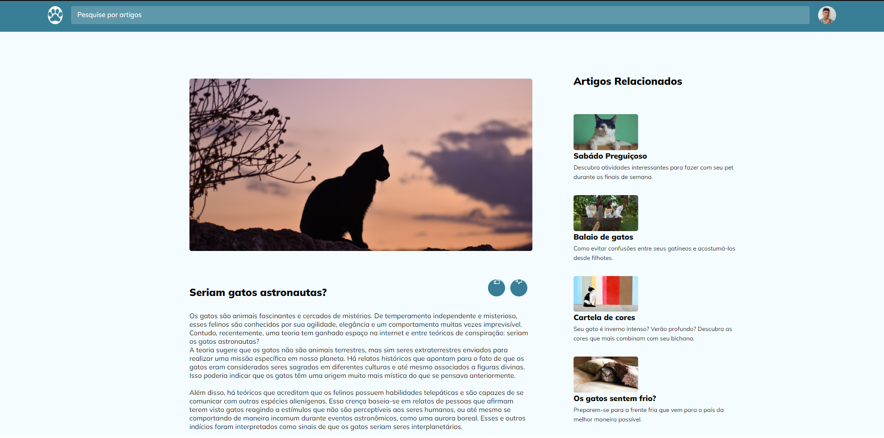
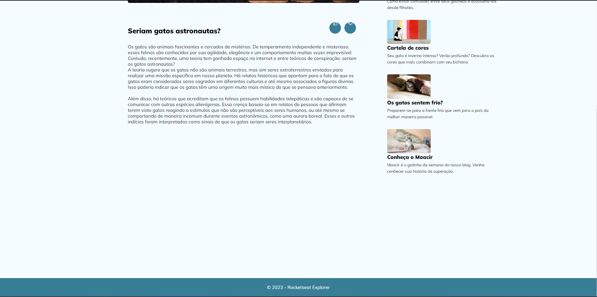
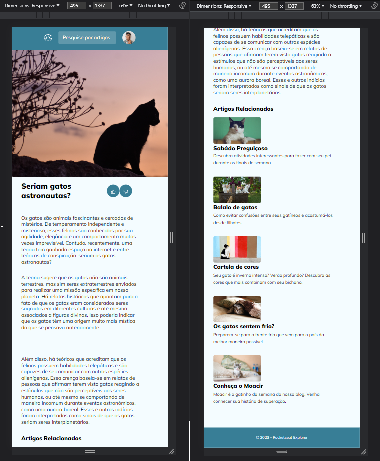

<h1 align="center">Blog de gatos</h1>

Um projeto baseado no desafio do explorer da Rocketseat.  

  <a href="#-tecnologias">Techs/Tecnologias</a>&nbsp;&nbsp;&nbsp;|&nbsp;&nbsp;&nbsp;
  <a href="#-projeto">Project/Projeto</a>&nbsp;&nbsp;&nbsp;|&nbsp;&nbsp;&nbsp;
  <a href="#-layout">Layout</a>&nbsp;&nbsp;&nbsp;|&nbsp;&nbsp;&nbsp;
  <a href="#memo-licença">License/Licença</a>

  

  

  

## 🚀 Techs / Tecnologias

Esse projeto foi desenvolvido com as seguintes tecnologias:

- HTML e CSS
- Git e Github

## 💻 Project / Projeto
    Um blog de gatos baseado no layout do Figma disponibilizado pelo curso Explorer.

## 🔖 Layout

Você pode visualizar o layout do projeto através do repositório. 

Feito com amor por Lara.
Made w/ love by Lara.